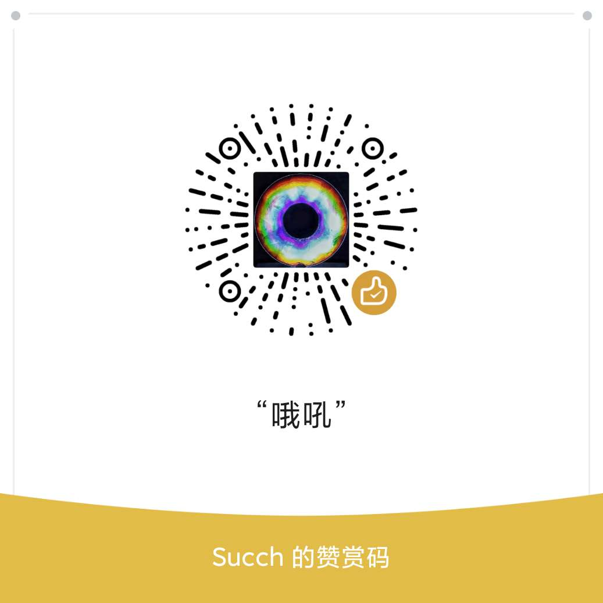

# [BLOG](https://github.com/Succh/BLOG/issues)
在lssues建了博客

# 空博客
频道主要分享一些个人喜欢的。
资源都从互联网收集。

## 目录

* [科学上网](https://github.com/Succh/BLOG/labels/%E7%A7%91%E5%AD%A6%E4%B8%8A%E7%BD%91%E5%88%86%E4%BA%AB)
* [软件分享](https://github.com/Succh/BLOG/labels/%E8%BD%AF%E4%BB%B6%E5%88%86%E4%BA%AB)
* [网站分享](https://github.com/Succh/BLOG/labels/%E7%BD%91%E7%AB%99)
* [教程](https://github.com/Succh/BLOG/labels/%E6%95%99%E7%A8%8B)

## 订阅频道
您可以订阅我下面的频道，不一定可以随时收到最新内容>_<
* [Bilibili 哔哩哔哩](https://space.bilibili.com/9187486)
* [YouTube](https://www.youtube.com/channel/UCzUdYcR8YhvPIQKwAkzw0PQ)
* [Github](https://github.com/Succh)

## 捐赠

如果教程对你有帮助，可以扫描以下二维码请我喝杯咖啡。*Thanks you very much*

